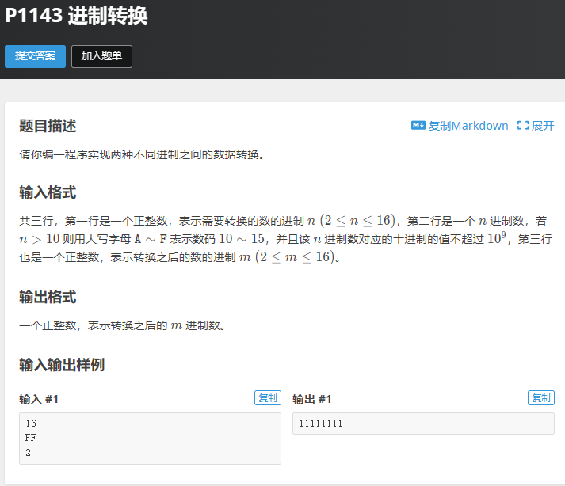

# 刷题总结

## 1.二分

lower_bound(a,a+n,3)函数
upper_bound(a,a+n,3)函数

```c++
#include <bits/stdc++.h>
using namespace std;
typedef long long ll;
int main (void){
    int n,c;
    ll arr[2000],sum=0;
    scanf("%d%d",&n,&c);
    for (int i=0;i<n;i++)
        scanf("%lld",&arr[i]);
    
    sort(arr,arr+n);
    for (int i=0;i<n;i++)
        sum +=upper_bound(arr,arr+n,arr[i]+c)-lower_bound(arr,arr+n,arr[i]+c);
    cout<<sum<<endl;
    return 0;
}
```

## 2.并查集

```c++
//查找父节点
int find (int i)
{
    if (i==fa[i])
        return i;
    else
    {
        fa[i]=find(fa[i]);
        return fa[i];
    }
        
}

//合并
void join(int x,int y)
{
    int fax=find(x);
    int fay=find(y);
    if (fax!=fay)
    {
        fa[fax]=fay;
    }
}
```

## 3.进制转换

**重点学习int2char，char2int和利用秦九韶算法将n进制转为10进制**


```c++
#include <bits/stdc++.h>
using namespace std;

int char2int (char ch)
{
    return ch>='0' && ch <='9' ? ch-'0':ch-'A'+10;
}

char int2char(int n)
{
    return n>=0 && n<=9 ?'0'+n: 'A'+n-10;
}


int main (void){
    int n,m,sum=0,index=0,output[30];
    string s;
    cin>>n>>s>>m;
    
    //n进制转10进制
    for (int i=0;i<s.length();i++)
    {
        sum =sum*n +char2int(s[i]);
    }

    //10进制转m进制

    while (sum !=0)
    {
        output[index++]=sum%m;
        sum =sum/m;
    }
    
    //输出

    for (int i=index-1;i>=0;i--)
        cout<<int2char(output[i]);


    return 0;
}
```

## 4.基础数学与数论
$$ (a+b+c)\%k=((a+b)\%k+c)\%k $$
$$ (a*b*c)\%k=((a*b)\%k*c)\%k $$

## 5.字符串
getchar()
putchar()
EOF
sscanf()
sprintf()
getline(cin,s)
**P1954**